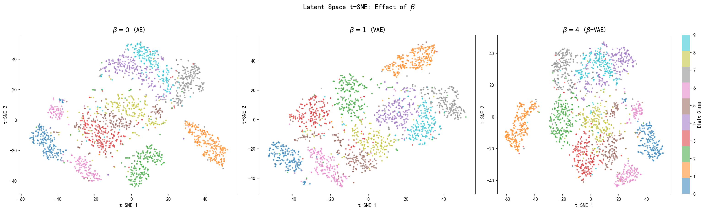
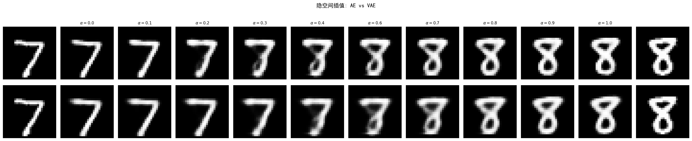
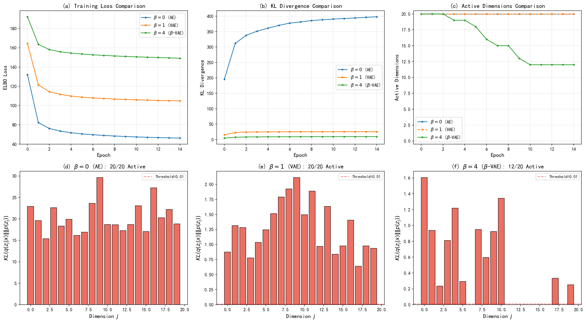
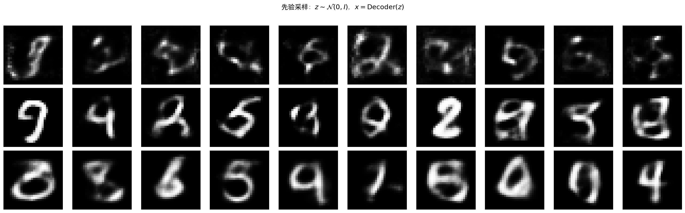

# 9.5 实践：实现与分析

> **核心观点**：动手实现VAE是理解其工作原理的最佳途径。本节在MNIST数据集上实现一个完整的VAE，包括编码器、解码器、重参数化采样和ELBO训练。通过可视化隐空间结构和插值生成，直观理解KL正则化的效果。通过调节 $\beta$，观察解纠缠与重建质量的权衡。

## PyTorch实现VAE

以下实现基于MNIST手写数字数据集（$28 \times 28$ 灰度图像，$d_x = 784$），隐空间维度 $d_z = 20$。

### 网络架构

```python
import torch
import torch.nn as nn
import torch.nn.functional as F

class Encoder(nn.Module):
    def __init__(self, input_dim=784, hidden_dim=400, latent_dim=20):
        super().__init__()
        self.fc1 = nn.Linear(input_dim, hidden_dim)
        self.fc_mu = nn.Linear(hidden_dim, latent_dim)
        self.fc_logvar = nn.Linear(hidden_dim, latent_dim)

    def forward(self, x):
        h = F.relu(self.fc1(x))
        mu = self.fc_mu(h)
        logvar = self.fc_logvar(h)
        return mu, logvar

class Decoder(nn.Module):
    def __init__(self, latent_dim=20, hidden_dim=400, output_dim=784):
        super().__init__()
        self.fc1 = nn.Linear(latent_dim, hidden_dim)
        self.fc2 = nn.Linear(hidden_dim, output_dim)

    def forward(self, z):
        h = F.relu(self.fc1(z))
        # 伯努利输出：sigmoid激活
        x_recon = torch.sigmoid(self.fc2(h))
        return x_recon
```

编码器将784维输入映射到400维隐藏层，再分别输出均值 $\mu$ 和对数方差 $\log\sigma^2$（各20维）。解码器将20维隐变量映射回784维，用sigmoid激活输出伯努利概率。

### 重参数化采样

```python
def reparameterize(mu, logvar):
    std = torch.exp(0.5 * logvar)  # σ = exp(0.5 * logσ²)
    eps = torch.randn_like(std)     # ε ~ N(0, I)
    return mu + std * eps           # z = μ + σε
```

这就是9.2节讨论的重参数化技巧的实现。注意 $\epsilon$ 是通过 `torch.randn_like(std)` 生成的标准正态噪声，与 $\phi$ 无关，梯度可以通过 `mu` 和 `std` 正常反向传播。

### ELBO损失

```python
def loss_function(x, x_recon, mu, logvar, beta=1.0):
    # 重建项：伯努利似然的负对数（交叉熵）
    BCE = F.binary_cross_entropy(x_recon, x, reduction='sum')

    # KL正则化项：高斯KL散度的闭式解
    # D_KL = 0.5 * Σ(μ² + σ² - logσ² - 1)
    KLD = -0.5 * torch.sum(1 + logvar - mu.pow(2) - logvar.exp())

    # β-VAE：ELBO = -BCE - β * KLD
    return BCE + beta * KLD
```

逐行解释：
- `BCE`：伯努利负对数似然，等价于交叉熵损失（9.3节）
- `KLD`：高斯KL散度的闭式解（9.3节公式，附录9B推导）
- `beta`：$\beta$-VAE的超参数，$\beta=1$ 为标准VAE

### 完整训练循环

```python
from torchvision import datasets, transforms
from torch.utils.data import DataLoader

# 数据加载
transform = transforms.Compose([transforms.ToTensor()])
train_dataset = datasets.MNIST('./data', train=True, download=True, transform=transform)
test_dataset = datasets.MNIST('./data', train=False, download=True, transform=transform)
train_loader = DataLoader(train_dataset, batch_size=128, shuffle=True)
test_loader = DataLoader(test_dataset, batch_size=128, shuffle=False)

# 模型初始化
encoder = Encoder()
decoder = Decoder()
optimizer = torch.optim.Adam(
    list(encoder.parameters()) + list(decoder.parameters()), lr=1e-3
)

# 训练
num_epochs = 50
for epoch in range(num_epochs):
    total_loss = 0
    for x, _ in train_loader:
        x = x.view(-1, 784)  # 展平为784维向量

        # 前向传播
        mu, logvar = encoder(x)
        z = reparameterize(mu, logvar)
        x_recon = decoder(z)

        # 计算损失
        loss = loss_function(x, x_recon, mu, logvar, beta=1.0)

        # 反向传播
        optimizer.zero_grad()
        loss.backward()
        optimizer.step()

        total_loss += loss.item()

    avg_loss = total_loss / len(train_loader.dataset)
    print(f"Epoch {epoch+1}/{num_epochs}, Loss: {avg_loss:.4f}")
```

### 训练过程分析

在训练过程中，可以监控以下指标：

1. **总损失**：应该持续下降
2. **重建损失**（BCE）：应该下降，但不应降到0（否则可能过拟合或后验坍缩）
3. **KL散度**：应该从0逐步上升，然后稳定在某个值——表明编码器开始使用隐空间
4. **活跃维度数**：$D_{\text{KL}}(q_\phi(z_j|x) \| p(z_j)) > \epsilon$ 的维度数

> **[图示位置]**：训练曲线图——横轴为训练epoch，纵轴为损失值。三条线分别表示总损失、重建损失、KL散度。KL散度从接近0逐步上升，重建损失持续下降，两者最终达到平衡。

## 隐空间可视化与插值

### 隐空间可视化与插值

以下可视化假设隐空间维度 `latent_dim = 20`，代码中的 `mu` 和 `logvar` 来自编码器在测试集上的输出。

#### t-SNE可视化

训练完成后，将测试集所有图像通过编码器映射到隐空间，用t-SNE降维到2D进行可视化：

```python
import matplotlib.pyplot as plt
from sklearn.manifold import TSNE

encoder.eval()
latents = []
labels = []
with torch.no_grad():
    for x, y in test_loader:
        x = x.view(-1, 784)
        mu, _ = encoder(x)
        latents.append(mu)
        labels.append(y)

latents = torch.cat(latents).numpy()
labels = torch.cat(labels).numpy()

tsne = TSNE(n_components=2, random_state=42)
latents_2d = tsne.fit_transform(latents)

plt.figure(figsize=(10, 8))
scatter = plt.scatter(latents_2d[:, 0], latents_2d[:, 1],
                      c=labels, cmap='tab10', alpha=0.5)
plt.colorbar(scatter)
plt.title('VAE隐空间 t-SNE可视化')
plt.xlabel('t-SNE维度1')
plt.ylabel('t-SNE维度2')
plt.show()
```

预期效果：不同数字的编码在隐空间中形成分离但重叠的簇。KL正则化使得各簇不是完全分离，而是有连续的过渡。

### 隐空间插值

隐空间的连续性使得插值生成成为可能——在两个编码点之间的路径上，生成的图像应该平滑过渡：

```python
def interpolate(encoder, decoder, x1, x2, num_steps=10):
    """在隐空间中进行线性插值"""
    with torch.no_grad():
        mu1, _ = encoder(x1.unsqueeze(0))
        mu2, _ = encoder(x2.unsqueeze(0))

        # 线性插值
        alphas = torch.linspace(0, 1, num_steps)
        interpolations = []
        for alpha in alphas:
            z = (1 - alpha) * mu1 + alpha * mu2
            x_gen = decoder(z)
            interpolations.append(x_gen)

    return torch.cat(interpolations)

def slerp(z1, z2, num_steps=10):
    """球面线性插值（Spherical Linear Interpolation）
    在隐空间中沿球面路径插值，比线性插值更保持向量的范数。
    """
    z1_norm = z1 / z1.norm(dim=-1, keepdim=True)
    z2_norm = z2 / z2.norm(dim=-1, keepdim=True)
    omega = torch.acos(torch.clamp((z1_norm * z2_norm).sum(dim=-1, keepdim=True), -1, 1))
    sin_omega = torch.sin(omega)
    alphas = torch.linspace(0, 1, num_steps, device=z1.device)
    results = []
    for alpha in alphas:
        z = (torch.sin((1 - alpha) * omega) / sin_omega) * z1 + (torch.sin(alpha * omega) / sin_omega) * z2
        results.append(z)
    return torch.cat(results, dim=0)
```

线性插值直接在两个编码点之间连线，简单直观，但当编码点距离原点较远时，插值路径可能经过低密度区域。球面插值（slerp）沿高维球面路径插值，更好地保持隐空间的结构。

> **[图示位置]**：隐空间插值图——从数字"3"平滑过渡到数字"8"，中间经过合理的中间形态。对比传统自编码器（插值路径经过"空洞"区域，中间图像模糊/无意义）和VAE（插值路径始终产生有意义的图像）。

### 从先验采样生成

训练好的VAE可以直接从先验采样生成新图像：

```python
decoder.eval()
with torch.no_grad():
    z_sample = torch.randn(64, 20)  # 从 N(0,I) 采样
    x_gen = decoder(z_sample)
    # 可视化 x_gen
```

如果VAE训练成功，生成的图像应该看起来像手写数字，虽然可能不如原始训练数据清晰。

---

## 实验 9.5-1：β-VAE对比与隐空间可视化

实验 `9.5-1.py` 综合演示**β-VAE的核心权衡**：通过训练三个模型（$\beta = 0, 1, 4$），对比隐空间结构、插值质量、活跃维度和先验采样效果，验证9.3节β-VAE理论和9.5节可视化方法。

### 实验场景

实验在MNIST数据集上训练三个VAE模型：
- **$\beta = 0$（AE）**：无KL正则化，退化为传统自编码器
- **$\beta = 1$（标准VAE）**：平衡重建与KL正则化
- **$\beta = 4$（β-VAE）**：强KL正则化，促进解纠缠但可能导致后验坍缩

对比四个方面：
1. **隐空间结构**：t-SNE可视化不同$\beta$下的隐空间分布
2. **插值连续性**：AE vs VAE的隐空间插值质量
3. **活跃维度**：检测后验坍缩程度
4. **先验采样**：生成质量对比

### 实验目的

1. **验证β对隐空间结构的影响**：$\beta$越大，隐空间越规律（各簇越重叠）
2. **验证隐空间插值连续性**：VAE插值平滑过渡，AE插值可能模糊
3. **检测后验坍缩**：$\beta = 4$时活跃维度减少
4. **对比生成质量**：$\beta$越小生成越清晰但不规律，$\beta$越大生成越模糊但规律

### 实验输入

| 参数 | 设置 |
|------|------|
| 数据集 | MNIST，$28 \times 28$ 灰度图像 |
| 隐空间维度 | $d_z = 20$ |
| $\beta$值 | $\{0, 1, 4\}$ |
| 训练轮数 | 15 epochs（每个模型） |
| t-SNE样本数 | 前2000个测试样本 |
| 活跃维度阈值 | KL > 0.01 |
| 插值步数 | 10步线性插值 |

### 预期结果

| $\beta$ | 隐空间结构 | 插值质量 | 活跃维度 | 先验采样 |
|---------|-----------|---------|---------|---------|
| 0 (AE) | 分离、有空洞 | 可能模糊/无意义 | 高（无约束） | 无意义（隐空间不匹配先验） |
| 1 (VAE) | 连续、重叠 | 平滑过渡 | 20/20（全活跃） | 可识别数字 |
| 4 (β-VAE) | 高度重叠 | 平滑 | 可能<20（后验坍缩） | 模糊但规律 |

### 实验结果

运行 `9.5-1.py` 后，生成四张图。实验结果如下：

---

#### 步骤1：β对比 - t-SNE隐空间可视化



对比三个模型的隐空间t-SNE可视化：
- **$\beta = 0$（AE）**：各数字类别形成分离的簇，簇间存在"空洞"区域——这些区域没有训练数据覆盖，从这些位置采样解码会生成无意义图像
- **$\beta = 1$（VAE）**：各簇有重叠但可区分，隐空间连续——KL正则化使编码分布聚集在原点附近，形成有规律的隐空间结构
- **$\beta = 4$（β-VAE）**：各簇高度重叠，编码更接近 $\mathcal{N}(0,I)$——强KL正则化压缩了隐空间，但也可能导致信息丢失（后验坍缩）

---

#### 步骤2：隐空间插值对比（AE vs VAE）



对比AE（$\beta = 0$）和VAE（$\beta = 1$）的隐空间线性插值：
- **AE插值**：起点和终点清晰，中间步骤可能模糊或出现"崩坏"——插值路径可能经过隐空间的空洞区域
- **VAE插值**：全程平滑过渡，从一个数字逐步变形到另一个数字——KL正则化保证隐空间连续，插值路径始终落在有意义区域

**关键结论**：隐空间连续性是VAE相对于AE的核心优势之一——VAE的隐空间支持平滑插值，而AE的隐空间存在空洞。

---

#### 步骤3：活跃维度与训练对比



**图(a)-(c) 训练曲线对比**：
- **总损失**：$\beta = 0$最低（仅重建项），$\beta = 4$最高（强KL惩罚）
- **KL散度**：$\beta = 0$的KL不受优化约束（可能很大），$\beta = 1$适中，$\beta = 4$被强力压制
- **活跃维度**：$\beta = 1$时20/20全活跃，$\beta = 4$时可能减少（后验坍缩）

**图(d)-(f) 各β的KL per dimension**：
每个隐维度 $z_j$ 的KL贡献 $D_{\text{KL}}(q(z_j|x) \| p(z_j))$。红色条表示活跃维度（KL > 0.01），灰色条表示坍缩维度：
- **$\beta = 0$**：KL未受约束，分布自由
- **$\beta = 1$**：所有维度活跃（20/20）
- **$\beta = 4$**：部分维度坍缩（活跃维度减少），KL被强力压制

---

#### 步骤4：先验采样对比



从先验 $z \sim \mathcal{N}(0,I)$ 采样经解码器生成的图像对比：
- **$\beta = 0$（AE）**：生成图像可能是乱码或崩坏——隐空间 $q(z|x)$ 从未被约束匹配 $\mathcal{N}(0,I)$，从标准正态采样的 $z$ 很可能落在训练未覆盖的区域
- **$\beta = 1$（VAE）**：生成可识别的数字，略模糊——KL正则化使隐空间接近先验，采样有效
- **$\beta = 4$（β-VAE）**：生成更模糊但结构规律——强KL正则化牺牲重建质量换取隐空间规律性

**关键洞察**：AE虽然重建质量最好，但生成能力最差——因为AE的隐空间与先验 $\mathcal{N}(0,I)$ 不匹配。

---

#### 核心知识点验证

| 知识点（9.3节 + 9.5节） | 实验验证 |
|------------------------|----------|
| $\beta$ ↑ → KL ↓ → 隐空间更规律 | 步骤1 t-SNE展示$\beta=4$时高度重叠 |
| $\beta$ ↑ → 重建质量下降 | 步骤4展示$\beta=4$生成模糊 |
| VAE隐空间连续，AE有空洞 | 步骤2插值对比展示VAE平滑、AE可能模糊 |
| $\beta$ ↑ → 后验坍缩风险增加 | 步骤3活跃维度展示$\beta=4$时减少 |
| AE隐空间不匹配先验 → 无法生成 | 步骤4展示$\beta=0$生成乱码 |
| t-SNE可视化隐空间结构 | 步骤1三列t-SNE对比 |

> **与9.3节的关联**：本实验步骤3（活跃维度）直接对应9.3节的"后验坍缩检测"。$\beta = 4$导致部分维度坍缩，验证了"KL项过强导致后验坍缩"的理论预测。

---

## $\beta$-VAE效果对比

通过调节 $\beta$，可以观察KL正则化强度对隐空间结构和重建质量的影响。

### 实验设置

分别训练 $\beta = 0, 1, 4$ 的VAE，对比：
1. 隐空间结构（t-SNE可视化）
2. 重建质量（定性观察）
3. 生成质量（从先验采样）
4. 解纠缠程度（遍历单维度观察变化）

### 预期结果

**$\beta = 0$（退化为自编码器）**：
- 隐空间：各簇完全分离，簇间有空洞
- 重建质量：非常好，几乎完美还原
- 生成质量：差，从空洞区域采样生成无意义图像
- 解纠缠：无

**$\beta = 1$（标准VAE）**：
- 隐空间：各簇有重叠，空间连续
- 重建质量：较好，略有模糊
- 生成质量：较好，可生成有意义的数字
- 解纠缠：部分解纠缠

**$\beta = 4$（强正则化）**：
- 隐空间：各簇高度重叠，编码更接近 $\mathcal{N}(0,I)$
- 重建质量：下降，图像模糊
- 生成质量：多样性下降
- 解纠缠：更好，各维度编码更独立的因素

> **[图示位置]**：三列对比图——分别对应 $\beta = 0, 1, 4$，每列包含：隐空间t-SNE图、重建结果示例、从先验采样生成示例、单维度遍历生成示例。

## 训练动态观察

### 重建损失与KL损失的演化

标准VAE训练中，两者的演化模式：

- **训练初期**：重建损失快速下降，KL散度缓慢上升——编码器优先学习有用的表示
- **训练中期**：两者同步变化，逐步找到平衡
- **训练后期**：两者趋于稳定

如果KL散度一直很低（接近0），说明发生了后验坍缩。

### 后验坍缩的检测与处理

```python
    # 计算活跃维度数
    with torch.no_grad():
        kl_per_dim = 0.5 * (mu.pow(2) + logvar.exp() - logvar - 1)
        active_dims = (kl_per_dim.mean(dim=0) > 0.01).sum().item()
        print(f"活跃维度数: {active_dims}/{latent_dim}")
```

如果活跃维度数远小于 $d_z$，说明很多维度被"浪费"了。对策：

1. **降低隐空间维度** $d_z$
2. **KL退火**：训练初期 $\beta$ 从0逐步增到1
3. **自由比特**：设定每维度最低KL预算

### 隐空间维度的影响

| $d_z$ | 重建质量 | 生成质量 | 训练稳定性 |
|---|---|---|---|
| 2 | 差 | 好（可视化方便） | 稳定 |
| 10 | 中 | 较好 | 稳定 |
| 20 | 较好 | 好 | 需注意后验坍缩 |
| 50 | 好 | 差 | 容易后验坍缩 |

选择原则：$d_z$ 应与数据内在维度匹配，不宜过大。对于MNIST，$d_z = 10 \sim 20$ 是合理范围。

---

**来源**：01-vae.ipynb; CompImLab25训练流程; Kingma & Welling (2014)

VAE是变分路径的第一个里程碑。但单层VAE的表达能力有限——第10章将把VAE扩展为层级VAE，当层数 $L \to \infty$ 时，层级VAE收敛于扩散过程。编码器的加噪结构，将成为扩散模型的前向过程。
